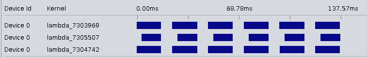

# Intel_OCL_Snippets
***
## Autorun Kernels
- [x] Autorun Kernels should be applied on intermediate kernels which don't have any parameters.
  - requirements
    - single workitem kernel
    - kernels without parameters
    - kernels use channels
    
  
  
   with autorun kernels the above executaion time reduces to 128.96
  - Profiling Autorun kernels severly reduces the performance the profile call in runtime should be used wisely.
  - To benefit from autorun overhead reduction reqd_work_group_size(1,1,1) should be removed. only max_global_work_dim and autorun attributes should be applied.
 
- [x] To optimize resource overhead, in case of single work-item kernles, (1,1,1), max_global_work_dim(0) should be set
  - outcome: less resource usage
* Note: non_blocking channels are useful if packet lost in tolerated.
It seems the solution to avoid pipeline stalls between kernels is to use either multiple kernel queues or using Autorun kernels in conjuction with channels otherwise the kernels should be investigated by [Dynamic profiler](https://www.intel.com/content/www/us/en/programmable/documentation/mwh1391807516407.html#vcg1470763338276) and analysing stall and occupancy percentage on different stages]
- [ ] Inferring shift registers for relaxing loop-carried dependencies, mostly occcurs due to the floating point operations
  - It can be applied by introducing a shift-register intrinsic in the compiler 
  
-  Pipes are similar to channels but they need kernel parameters like HLS counterpart

- [ ] Implement [Double buffering](https://www.intel.com/content/www/us/en/programmable/documentation/mwh1391807516407.html) for host code 
